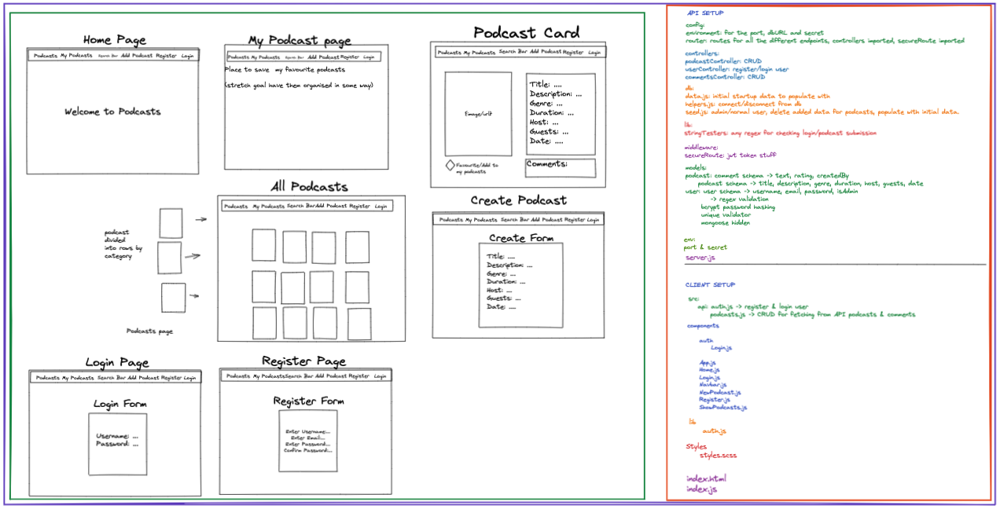
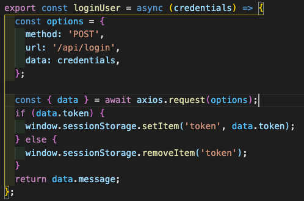
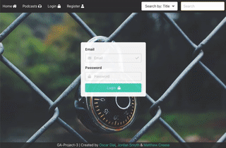

## Purely Podcast

This was the third project of the GA Software Engineering Immersive course. I was grouped with two colleagues and we quickly decided that a podcast app would be a good product to deliver which hit the brief we had been given. We all had a mutual interest in and were keen listeners of podcasts.

[Enter Site Here](https://podcastsapp.netlify.app/)

### Technologies Used

VS code, NPM, Nodemon, Express, MongoDB, Postman, Git, JavaScript React & associated packages, React Router Dom Github, Google Chrome dev tools, Heroku (deployment), Trello Board (planning and timeline), Excalidraw

### The Process

#### Day 1

After settling on a podcast theme for our project we started by designing wireframes and setting out required features using excalidraw this helped us have a clear objective for what we wanted to deliver as our minimal viable product and also our stretch goals (time limits permitting). This was our first introduction to Trello which I found was invaluable for organising, compiling and delegating work.

#### Day 2 - 3

As a team we decide that we wouldnt start on the frontend before the backend functionality was complete and thoroughly tested. We mob programmed a primitive backend very quickly. Although we used previous work as a reference and a lot of the code being relatively boilerplate, I personally feel like I learned a lot about how the secure route works and how those different components fit together.
I helped build and test the CRUD operators for the podcast, comments and user acccounts.

#### Day 4 - 9

We quickly moved onto frontend functionality and I built a secure registration and login function with React. I found this quite useful in helping me reinforce my knowledge of the relationships between the frontend and backend and how they 'talk' as well as how Axios promises are used to make HTTP requests. Below is a piece of code which was a bit of a "light-bulb" moment for me.

    

As one of my colleagues had built the functionality to search for podcasts using different parameters I wanted to test how it worked and what the end result would be for the user. Therefore I wrote some seed data to populate the website. I continued to work on aesthetics and styling, thinking about user interaction and user experience. Originally the Create Podcast and Edit Podcast pages had an onChange handler for all the fields including 'genre'. I decided that it probably wouldn't be for th ebest to have an open ended field with countless possibilities for genres thereofre I changed this to a dropdown of preselelected categories and added a handleChange function.

#### Additional Future Goals

Although I'm happy with what we achieved as a team, I believe we could have implemented even more security regarding the password, by requiring capitalisation plus a combination of words and letters. I also personally wanted to implement pagination or a carousel to improve the user experince. At the moment all of the podcasts appear on one page, so when the number of podcast becomes larger navigation will become more difficult.

#### Reflections

Key learnings from this project were the importance of planning and delegating work. This was the first time I had worked with Trello and I found it really helpful to work through the tickets methodically as a team. This was also the second time using GitHub and I feel I gained invaluable experience using something which is a standard in the industry and absolutely necessary when working in teams. This was also a chance for us to cement what we had learnt about backend development specifically secure routes and JWT token authentification, a subject I found conceptually quite difficult to grasp.

Another huge takeaway from this project was the necessity to follow a gramatically correct and logical naming convention for different functions and variables to provide clarity for myslef and anyone else who reads the code. As we took the first weekend off from any work on Purely Podcast, we came back to the code with some confusion as to what some variables and functions were actually referring to. In future this is something I will always take into careful consideration.

